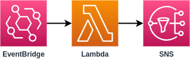

# Pretty Print SNS Emails from EventBridge

SNS emails from EvenBridge are difficult to read because they're an unformatted JSON string.

This function will take the message from EventBridge, pass it through `json.dumps()` in your Lambda function to make it more readable ("pretty print"), then publish it to your SNS topic.

## What it will look like



## Input

You'll need to create `topic_arn` environment variable and set it to your SNS topic's arn - `arn:aws:sns:<region>:<account_id>:<topic_name>`.

## Lambda Execution Policy

```json
{
  "Version": "2012-10-17",
  "Statement": [
    {
      "Sid": "PublishSNSMessage",
      "Effect": "Allow",
      "Action": "sns:Publish",
      "Resource": "arn:aws:sns:<region>:<account_id>:<topic_name>"
    }
  ]
}
```